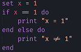
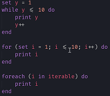
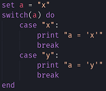
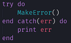
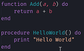
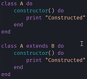
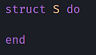
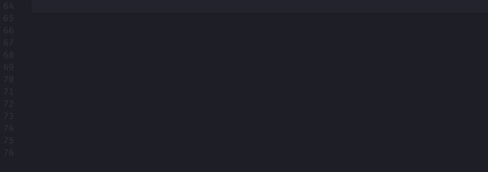

# Pseudocode

A simple extension for syntax highlighting of generic pseudocode.

Syntax highlighting exists for multiple variants of common pseudocode keywords, allowing you to use your own style and not confining you to a specific format.

## Features

### Syntax Highlighting

The following items have syntax highlighting. Synonyms are separated by spaces.

#### Keywords:
```
output print e.g. output "Hello World"
input
if
else
try
catch except
import
while loop
for
foreach
return
set e.g. set x = 1
switch
case
break
do
end
```
#### Operators:
```
and &&
or ||
not !
in
```
#### Functions:
```
function
procedure
e.g.
    function say(x) do
        print x
    end
    say("Hello World")
```
#### Classes:
```
class
extends
e.g.
    class A do
        constructor() do
            print "Hi"
        end
    end
e.g.
    class B extends A do
        constructor() do
            print "Hi"
        end
    end
```
If Else:



Loops:



Switch:



Try Catch:



Functions:



Classes:



Structs:



### Snippets


## Known Bugs

- do end autocloses in variables

## Release Notes

### 1.1.0

- Added structs
- Added `struct` and `structdo` snippets

### 1.0.3

- Fixed bug where do end would be autoclose in strings and comments

### 1.0.2

- Fixed bug which prevented comments in functions and procedures

### 1.0.1

- Minor changes to extension information

### 1.0.0

- Initial release with syntax highlighting and snippets for basic statements and definitions.
